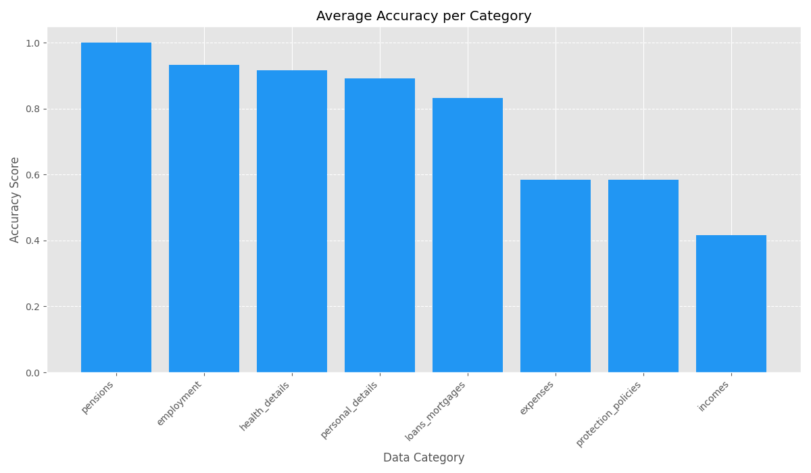

# DESCRIPTION
# Financial Adviser Conversation Analysis Pipeline

This toy project implements an end-to-end pipeline for generating, extracting, and analyzing financial adviser-client conversations. It creates synthetic conversation data with matching ground truth, extracts structured information using LLMs, and provides comprehensive analysis of extraction accuracy.

The pipeline consists of three main components:
1. **Synthetic Data Generation**: Creates realistic financial adviser-client conversations with corresponding structured JSON data
2. **Information Extraction**: Processes conversation transcripts to extract structured data using LLMs
3. **Analysis and Evaluation**: Compares extracted data against ground truth, generating detailed metrics and visualizations

NOTE: This project is far from being production ready. It serves as a proof of concept and experimental pipeline. A comprehensive set of future possible improvements can be found in the "POSSIBLE IMPROVEMENTS" section below.

## SYNTETIC DATA GENERATION

Our pipeline creates realistic financial adviser-client conversations with matching structured data. We generate both natural-sounding dialogues and structured JSON together in one process.
We start by building a JSON schema based on the General Fact Find Template (GFFT) from pdf. Then we create the transcript by working through different sections of the schema one at a time. We chose this step-by-step approach to make sure the conversation covers all the needed fields, which would be tough if we tried to generate the whole transcript at once.
For each conversation chunk, we also create JSON where the relevant GFFT sections are filled with data that comes up naturally in the dialogue. The JSON builds up gradually across the conversation.
At the end, we combine all the dialogue chunks and partial JSONs to create a complete package: a realistic transcript paired with JSON containing all the data mentioned in the conversation.

### Algorithm Flow

1. **Initialization**: Create empty template and randomized section queue
2. **Main Loop**:
   * Pop next section from queue
   * Identify missing fields in that section
   * Generate dialogue prompt with required fields and conversation context
   * Merge returned data into master JSON
   * Schedule digression after every 2-3 regular turns
3. **Termination**: Loop exits when all fields are filled or max turns reached

#### Prompt Design

**Two Distinct Prompt Types**:
  1. **Dialogue Prompt**: We generate dialogue chunks that correspond to different sections from the GFFT. Each time we create a conversation piece, we also produce matching JSON with the answers collected from the user that we can use as test data.
Instead of generating everything at once, we work through the JSON template one section at a time. Each prompt focuses only on filling in missing fields within a specific section. If any fields remain empty after a conversation turn, that section goes back into the queue for another attempt later.
When we're done, we combine all the conversation pieces and their corresponding JSON sections into one complete conversation and one complete JSON file.

   * **Inputs**: 
        - Last 3 lines of previous conversation (for continuity)
        - Current section path (e.g., "personal_details.client")
        - Randomly shuffled list of missing fields in that section
   * **Outputs**:
        - New conversation chunk (dialogue between adviser and client)
        - Structured JSON data for just that section's fields

  2. **Digression Prompt**: To make our synthetic transcripts feel more authentic, we occasionally add digressions where the Advisor uses previously gathered information to explain relevant financial concepts.
This mimics how real advisers don't just collect data but also educate clients along the way. These explanations happen automatically after every 2-3 data collection turns. The system uses the partial JSON we've built so far, allowing explanations to reference specific client details.
We also keep track of topics that have already been explained to avoid repetition in later conversations.

   * **Inputs**:
        - Last 3 lines of previous conversation
        - Complete current partial JSON (all data collected so far)
        - List of fields that have been populated but not yet explained
   * **Outputs**:
        - Educational dialogue where adviser explains concepts to client


## EXTRACTION

Our extraction pipeline processes financial adviser-client conversation transcripts to automatically pull out structured data into a standard JSON format. It takes the transcript files from our synthetic data generator and creates matching structured data files that capture all the client information.
We send each complete transcript to the LLM in a single API call, extracting all information at once. We provide an empty JSON template to give the model a clear extraction target to fill in.
We're starting with this one-shot processing approach as our baseline. If the extraction results don't meet our standards, we could switch to a multi-turn processing method instead.

### Prompt Design & Data Flow

#### Two-Message Prompt Structure

* **System Message**: Contains detailed extraction instructions and the complete GFFT JSON schema
* **User Message**: Contains only the transcript text to be processed

#### Data Flow

* **Input**: Complete conversation transcript from transcript.md
* **Processing**: Single API call to extract all structured data
* **Output**: Complete JSON matching the template schema, saved as extracted_data.json

## ANALYSIS
Our analysis pipeline evaluates how accurately we pull structured data from conversations by comparing the extracted data against what we know is correct. It uses a combination of exact matching, semantic similarity, and financial domain-specific rules to measure accuracy.
We've put significant effort into normalizing the data to ensure fair comparisons. The pipeline takes pairs of JSON files (the correct version and our extracted version) and creates detailed reports on how well the extraction is working.

### Comparison Algorithm Overview

* **Input**: Pairs of JSON files (ground truth and extracted data)
* **Processing**: Multi-stage comparison with exact and semantic matching
* **Output**: Detailed accuracy metrics and comparison reports

### Comparison Metrics

#### Exact Matching

*   For single words, IDs, codes, or categorical values (e.g., "male", "yes/no"), we require exact matches after normalization.
*   Numbers match if they're equal after type conversion (e.g., "25000" equals 25000).
*   Matches if the year and month components are identical (e.g., "2022-10-01" matches "2022-10").

#### Semantic Matching

*   For longer text, we remove "stop words" (e.g., "the", "and", "of") and compare meaningful words.
*   Fields match if 50% or more of the non-stop words are identical.
*   Recognizes equivalent entities ("Sophie", "Client", "Individual") as the same person.
*   Calculated as the size of word intersection divided by union (Jaccard Similarity)

#### Match Classification

*   Identical values after normalization or semantic match above 95%.
*   Semantic similarity between 50-95%.
*   Similarity below 50% or structurally different values.
*   Present in one document but absent in the other.

### Normalization Techniques

#### Text Normalization

*   All text converted to lowercase.
*   Stripped from text fields for better matching.
*   Multiple spaces, tabs, newlines converted to single space.
*   Common words ignored during content comparison.

#### Numeric Normalization

*   Numbers in string format ("1200") converted to numeric (1200).
*   Comma-separated values summed when appropriate (e.g., "250000,500000" compared to 750000).

#### Date Normalization

*   Different date formats normalized to "YYYY-MM" for comparison.
*   Month and year prioritized over exact day.

#### Entity Normalization

*   Maps different references to canonical form.
*   "Client" = "Individual" all recognized as same person.

### Result Metrics & Reporting

#### Accuracy Metrics

*   **Overall Accuracy**: (Exact Matches + Partial Matches) / Total Fields
*   **Category Accuracy**: Separate accuracy scores for each data category (personal, employment, financial).
*   **Field-Type Accuracy**: Performance analysis by field type (dates, numbers, text).

#### Visualization & Reporting

*   **Case Performance**: Bar charts showing accuracy rates across test cases.
*   **Category Performance**: Comparative visualization of extraction accuracy by data category.
*   **Issue Analysis**: Ranked list of most problematic fields with real examples.


# RESULTS

The analysis pipeline (`analyze_data.py`) compared the structured data extracted by the LLM (`extracted_data.json`) against the synthetically generated ground truth (`ground_truth.json`) for 6 test cases.

The key findings reveal an overall accuracy of **81.3%** in the extraction process. Out of 246 fields compared across all cases, there were 198 exact matches, 2 partial matches, 46 mismatches, and 9 fields missing from the extracted data.

Performance varied significantly across different data categories. High accuracy was observed for `pensions` (100%), `employment` (93.3%), `health_details` (91.7%), `personal_details` (89.2%), and `loans_mortgages` (83.3%). Conversely, categories like `expenses` (58.3%), `protection_policies` (58.3%), and `incomes` (45.8%) showed lower accuracy rates, indicating areas for potential improvement.

Visualizations summarizing these results are available below and in the `comparison_results` directory:





For a more granular view, including per-case metrics, detailed category breakdowns, and specific examples of extraction errors, please refer to the comprehensive HTML report: `comparison_results/detailed_report.html`.

# POSSIBLE IMPROVEMENTS

## Data Generation Enhancement

- Use more advanced models for generating the conversation. I used gpt4o-mini (to keep things cheap), more expressive models would perform better
- Use dynamic few shot examples to enforce style
- Iterate more on the prompt instructions to generate more expressive conversations
- Randomize the order of section generation and selectively populate sections based on scenario. For instance, we must always generate the personal details discovery section, but can dynamically decide whether to populate income sections based on client circumstances
- Enforce data normalization through better prompt design, adding specific instructions on JSON population to reduce normalization burden during analysis
- Implement generation parallelization using asyncio to accelerate synthetic data creation

## Data Quality and Verification

- Implement verification mechanisms to ensure transcript and ground truth JSON data consistency, potentially using an LLM as judge
- Require citations for each utterance in generated paragraphs to establish clear links between transcript content and extracted data
- Introduce controlled randomness in client responses to create more realistic and diverse conversational patterns
- Develop comprehensive validation steps to catch edge cases and inconsistencies before they propagate through the pipeline

## Extraction Pipeline Improvements

- Replace single-prompt extraction with a multi-step approach using targeted extraction for different information types
- Implement citation requirements to justify each extracted data point
- Utilize separate LLM verification steps to validate extraction quality
- Adopt specific pydantic models to enforce strict formatting and typing
- Develop progressive, iterative extraction approaches rather than zero-shot extraction to better capture complex information
- Incorporate LLM-based format adjustment tools to normalize inconsistent outputs

## Evaluation Framework Enhancement

- Expand evaluation approaches for different field types beyond basic accuracy metrics
- Include LLM as judge for qualitative assessment of complex field extractions
- Conduct detailed error analysis categorizing errors by type (false positives, false negatives, etc.)
- Implement more diverse metrics beyond accuracy to provide multidimensional quality assessment
- Analyze pipeline failure modes systematically, acknowledging that real-world conversations may not cover all data points
- Use model-in-the-loop similarity determination for complex answers where semantic similarity measures are insufficient

## Error Analysis and Debugging

- Perform systematic investigation of mismatches between extracted and ground truth data
- Implement targeted fixes to extraction logic based on error patterns
- Verify that fixes resolve specific mismatches without introducing new errors
- Document the root causes of extraction failures to inform future improvements
- Establish regression testing to ensure stability of extraction performance over time


# HOW TO USE

## Overview

The pipeline consists of three main steps:

1.  **Generate Synthetic Data (`generate_syntetic_data.py`):** Creates conversations between a financial adviser and a client, along with the corresponding ground truth data structured in a predefined JSON format (GTTF-style).
2.  **Extract Data from Transcripts (`extract_data_from_transcripts.py`):** Processes the generated transcripts using an LLM (e.g., GPT-4o) to extract information and populate the same JSON structure used for the ground truth.
3.  **Analyze Data (`analyze_data.py`):** Compares the ground truth JSON with the LLM-extracted JSON for each generated case, providing detailed accuracy metrics, reports, and visualizations.
4. **gfft.py**: Contains the GFFT (Generic Fact-Find Template) schema definition, which provides the standardized JSON structure used for both ground truth and extracted data.


## Installation

1.  **Clone the repo**


2.  **Set up OpenAI API Key**


3.  **Install dependencies**


## Run code

### Step 1: Generate Synthetic Data

This script simulates conversations and creates ground truth JSON files.

```bash
python generate_syntetic_data.py [OPTIONS]
```

**Arguments:**

*   `--num-cases INTEGER`: The number of synthetic cases (conversations) to generate. Default: `10`.

**Output:**

This step creates the directory specified by `--out-dir` (e.g., `synthetic_data_run1`). Inside this directory, it generates subdirectories for each case (e.g., `case_001`, `case_002`, ...). Each case subdirectory contains:

*   `transcript.md`: The generated conversation transcript.
*   `ground_truth.json`: The structured JSON data representing the ground truth for the conversation.

### Step 2: Extract Data from Transcripts

This script reads the generated transcripts and uses an LLM to extract data into a JSON file.

```bash
python extract_data_from_transcripts.py [OPTIONS]
```

**Arguments:**

*   `--model TEXT`: The OpenAI chat model to use for the extraction task (e.g., `gpt-4o`). Default: `gpt-4o`. Consider using a more powerful model for better extraction accuracy.


**Output:**

This step adds a JSON file (e.g., `extracted_data.json`) to each case subdirectory within the specified `--input-dir`. This file contains the data extracted by the LLM from the corresponding `transcript.md`.

### Step 3: Analyze Data

This script compares the `ground_truth.json` with the extracted data JSON (e.g., `extracted_data.json`) for each case and generates reports.

```bash
python analyze_data.py 
```


**Output:**

This step creates the directory specified by `--output-dir` (e.g., `comparison_results`) and saves the following files:

*   `summary_report.json`: A JSON file summarizing the overall accuracy, per-case metrics, category metrics, and common issues found during comparison.
*   `detailed_report.html`: An HTML report providing a user-friendly view of the summary data, including embedded charts.
*   `case_accuracy.png`: A bar chart visualizing the extraction accuracy for each individual case.
*   `category_accuracy.png`: A bar chart showing the average extraction accuracy across different data categories (e.g., personal details, employment, health).
*   `common_issues.png`: A horizontal bar chart highlighting the fields that most frequently had mismatches, partial matches, or were missing during extraction.


